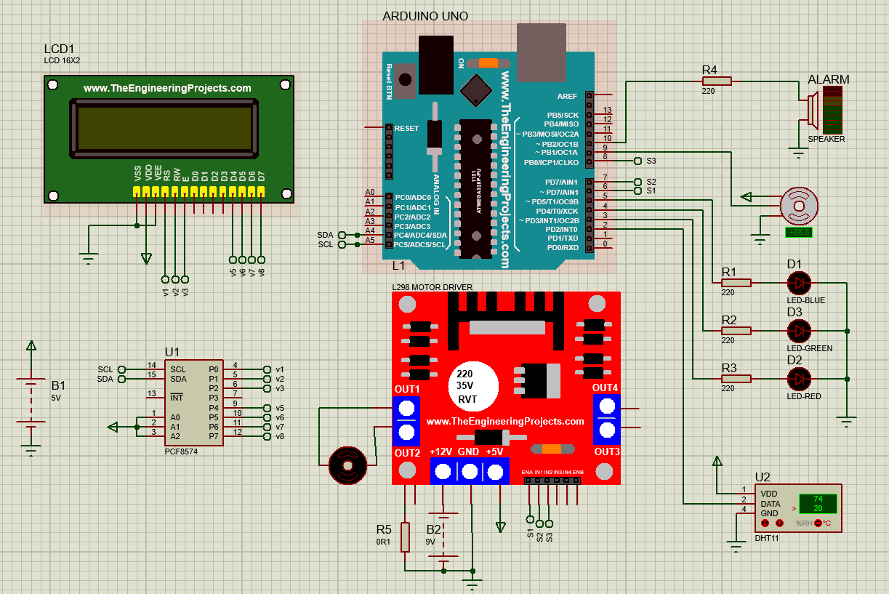
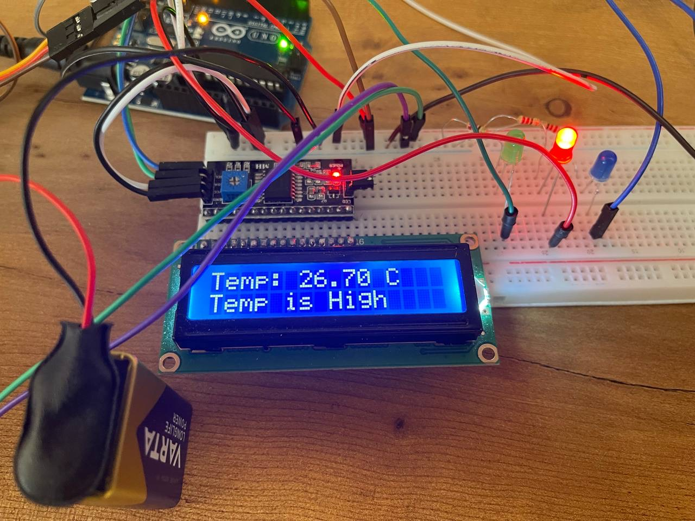

# Electronics-Course-Project
Instructor: Dr. Masoud Fakhrabadi
# Design, Implement and Control a Temperature Measurement System with Arduino & Proteus

## Project Overview
This project involved designing an electronic cooling system using an Arduino microcontroller, with the primary objective of monitoring and regulating temperature in real-time. The Arduino platform was chosen for its flexibility in interfacing with sensors and actuators. A temperature sensor was connected to the Arduino to measure the heat generated by electronic components. Based on the sensor readings, a custom program was written to automatically control a cooling fan and radiator, activating them when the temperature exceeded a predefined threshold and deactivating them once the temperature normalized.

## Simulation and Implementation:
The project began with circuit modeling and simulation in the Proteus software, as shown in image below: 

This step was crucial in verifying the functionality of the circuit before proceeding with the physical implementation. Following the simulation, the necessary components were procured, as detailed in below:

And the circuit was assembled. The final setup, documented in below:

Effectively demonstrated the system’s operation, with a video accompanying the report to provide a visual overview.

## System Capabilities and Insights
Throughout the project, the Arduino proved to be a powerful tool for implementing both simple and complex logic, such as sensor calibration and automated cooling control. By utilizing libraries within the Arduino environment, the temperature sensor was accurately calibrated, ensuring reliable performance. Additionally, the project highlighted the cost-effectiveness of using an LCD for data display, eliminating the need for a computer during monitoring.

## Conclusion
Overall, this project not only demonstrated the successful design and implementation of a temperature-controlled cooling system but also underscored the importance of simulation in circuit design and the practicality of Arduino for real-world applications.

### Team Members
I specially thank to my teammates: Amirreza Moharammi, Younes Heydari, Arian Ariakia for this valuable contribution. :)
